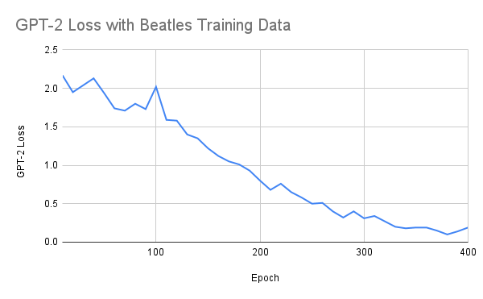

# SingerMerge

## Abstract
Throughout time and space, different artists have defined many different lyrical styles. From listening to a variety of songs, humans have a decent capacity to distinguish different artists, based just off lyrics. Can we train a model on our computers to do so, and even further, train a model to generate lyrics in that artists style? Text generation is a core problem in natural language processing. With the advent of massive language models like GPT-2, GPT-3, MT-NLG, we have become capable of producing significantly more realistic text than in the past.  Many of these models are transformer-based meaning that they can weight different parts of input data to get a better understanding of language and generate more logical text. We utilize these advances and focus on how well can we generate musical lyrics in the style of a particular artist using transfer learning from a pre-trained language model. 


## Problem Statement
We want to explore how well we can generate lyrics in a particular singer's style, and further, how well can we generate music in the combined style of two very different artists such that it has similarity to both of the singers independently. Specifically, we focus on the artists Beatles and Rihanna as they are two very different singers with lots of publically available lyrics. We use transfer learning from pre-trained GPT-2 to explore this and experiment with hyperparameters to generate reasonably musically sounding text that doesn't overfit and copy lines from input data. We finally explore ways to evaluate results and see how stylistically similar our generated lyrics for the Beatles is compared to real Beatles lyrics, how stylistically similar generated lyrics for Rihanna are compared to real Rihanna lyrics, and finally how stylistically similar our generated lyrics in their "mixed" style is to each of Beatles and Rihanna, independently. If we can generate text that is directly with style "in between" two different styles, it can have large implications on our understanding of language. 

              

## Related Work
To extract the lyrics, we use Genius API stacked with lyricsgenius package made by John Miller (https://github.com/johnwmillr/LyricsGenius).
To evaluate the lyrics, we use modified minhash algorithm to fit into the Python 3 environment (https://github.com/rahularora/MinHash)
Much of this paper is only possible due to GPT-2, a language massive language model made by OpenAI. (https://cdn.openai.com/better-language-models/language_models_are_unsupervised_multitask_learners.pdf)
We were able to actually obtain the model parameters and perform additional training(transfer learning) thanks to the package gpt-2-simple package made by Max Woolfe (https://github.com/minimaxir/gpt-2-simple).

## Methodology

### Accessing GPT-2 Model
GPT-2 is one of the world's largest language models publicly available. It has 1.5 billion parameters and was trained on over 40GB of internet text over a long period of time. Training a comprehensive language model from scratch takes lots of time and input data, so we use this model to start with, then use transfer learning to try to generate lyrics in a particular artists style. We chose this model because of ease of use and accessibility as well as the fact that it has a good model for English language and can generate English sentences to a decent degree already. We use the simple-gpt-2 package to get the parameters and to continue to train the model. It is a transformer-based models similar to those in past homework (except with two decoders instead of one), and we use it to generate next character giving some past charactars, thus generating text of arbitrary length.  

### Obtaining dataset
To use the lyricgenius package, we put artists' names inside a list and specify the number of songs we need for each artist, then the package can output the names of songs in popularity order and store all lyrics into a text file. To distinguish different songs, there is a tag "EmbedShare URLCopyEmbedCopy <endoftext>" between every pair of songs.
    
### Tuning Hyperparameters
To tune the hyperparameters, we start off with random search trying out different values of training rate, and number of epoch cutoff. Eventually, we found a learning rate of 1e-5 to work well, and we used 400 epochs for training set of Beatles, and of Rihanna, and 600 epochs for the combined training set (it was larger and thus we saw loss converged slower). Since loss is not exactly the best evaluation metric to see how well text was being generated, we also used human evaluation in seeing how much quality the generated text seemed to be after a certain amount of epochs, then deciding whether it needed more or less. 

First, we use gpt-2-simple to obtain the model parameters and then utilize its API to set hyperparameters like iterations and learning rate. What we do is then use transfer learning. Specifically, using the pretrained model, we do FURTHER training on particular training data. Specifically, we use three sets of training data, Beatles lyrics dataset, Rihanna lyrics dataset, and a mixed dataset with both of their lyrics. We use lyricsgenius package to generate these datasets. For each of these datasets, we find optimal hyperparameters and train it for 400-600 iterations depending on the size of the dataset (and to avoid overfitting as noticed happening when training for too long). Once we make models that are sufficiently trained on the particular datasets with low loss, we generate text using the GPT-2 model. 


## Evaluation
Once we generate text for our three models, we use the minhash algorithm which was our best method to measure stylistic similarity. To measure stylistic similarity was a very difficult ask, as most text similarity methods are based on _semantic_ meaning, rather than style, however this was the best approach we found.
    
To use the minhash algorithm, we put every generated song in separate files. Run "python shingles.py" to generate shingles and save the results using pickle. Based on the length of the saved result, we set the parameter "totalShingles" in minhash.py. Also, to make the result consistent, we set random seed to 0. Then we run "python minhash.py" to determine similarity. Regarding the data, folder 'test_b' saves The Beatles' result; folder 'test_m' saves the mixed result; and folder 'test_r' saves Rihanna's result.

### Mixed input result: (B for The Beatles and R for Rihanna)
| Jaccard Index | Song | Artist |
| :---: | :----: | :---: |
| 0.44 | Rocky Raccoon | B |
| 0.44 | Man Down | R |
| 0.4 | Ob-La-Di, Ob-La-Da | B |
| 0.4 | Woo | R |
| 0.4 | Don't Stop the Music | R |
| 0.4 | Pose | R |
| 0.36 | What Now | R |
| 0.32 | Happiness is a Warm Gun | B |
| 0.28 | Oh! Darling | B |
| 0.28 | Pour It Up | R |

### The Beatles input result:
| Jaccard Index | Song |
| :---: | :----: |
| 0.36 | Don't Let Me Down |
| 0.24 | Back in the U.S.S.R. |
| 0.24 | Sgt. Pepper’s Lonely Hearts Club Band |
| 0.2 | Help! |
| 0.2 | Ob-La-Di, Ob-La-Da |

### Rihanna input result:
| Jaccard Index | Song |
| :---: | :----: |
| 0.48 | S&M |
| 0.36 | Woo |
| 0.36 | Only Girl (In the World) |
| 0.32 | Yeah, I Said It |
| 0.32 | What Now |

### Similar songs (Jaccard Index >= 0.45) in popularity order (B for The Beatles, R for Rihanna, M for mix):
| Jaccard Index | Song1 | Song2 | Artist |
| :---: | :---: | :---: | :---: |
| 0.48 | Michelle (B) | When I’m Sixty-Four (B) | B |
| 0.48 | Michelle (B) | Yeah, I Said It (R) | M |
| 0.48 | Help! (B) | Close to You (R) | M |
| 0.48 | Ob-La-Di, Ob-La-Da (B) | Man Down (R) | M |
| 0.64 | Ob-La-Di, Ob-La-Da (B) | Woo (R) | M |
| 0.48 | Ob-La-Di, Ob-La-Da (B) | Don’t Stop the Music (R) | M |
| 0.52 | Ob-La-Di, Ob-La-Da (B) | What Now (R) | M |
| 0.48 | Don’t Let Me Down (B) | Pose (R) | M |
| 0.6 | Rocky Raccoon (B) | Man Down (R) | M |
| 0.6 | Rocky Raccoon (B) | Don't Stop the Music (R) | M |
| 0.48 | Rocky Raccoon (B) | What Now (R) | M |
| 0.52 | Back in the U.S.S.R. (B) | What Now (R) | M |
| 0.48 | Sgt. Pepper’s Lonely Hearts Club Band (B) | Take a Bow (R) | M |
| 0.56 | Man Down (R) | Don't Stop the Music (R) | R |
| 0.48 | Man Down (R) | What Now (R) | R |
| 0.56 | Close to You (R) | Don't Stop the Music (R) | R |
| 0.56 | Close to You (R) | What Now (R) | R |
| 0.52 | Woo (R) | Only Girl (In the World) (R) | R |
| 0.48 | Woo (R) | What Now (R) | R |
| 0.48 | Woo (R) | We Found Love (R) | R |
| 0.48 | Pour It Up (R) | What Now (R) | R |
| 0.56 | Pour It Up (R) | Take a Bow (R) | R |

## Results
As seen from Figure 1,2,3, the model trained relatively well in the sense that with our hyperparameter selection, the loss got closer and closer to zero. 
## Figures

 Figure 1: Loss w/ Beatles Training Data
 
 
 
 Figure 2: Loss w/ Rihanna Training Data
 
 
 
 
 Figure 3: Loss w/ Mixed Training Data
 
 

 
 Figure 4 generated text after 200 iteration of training on Beatles
 
```
======== SAMPLE 1 ========
 better at the wheel), but I do love when I can drive the car on the corner

  No, I won't burn

  Don't make it worse, don't make it worse 

(Oh yeah, see you next time)<|endoftext|>New York City has been rocked by a mass shooting since the start of the new year. So what is an "angel of death"?

The New York Times

There is no word yet on the cause of death of the first person to be killed in the shooting in a Jewish market in Paris on Feb. 13, 2012. (Eve Shopham/The Washington Post)

The first-person shooter

No, not a Jewish man
Who told you to "shoot the Jews"?

When we pray together,
We've got your back

We just need to be mindful of each other

You're breathing life into this world,
Shall we go check on him?
(He's dead)

The mother fucker
Why don't you tell him to stop?
(You're dead)

It's impossible for him to see through these eyes
Because he's too young to be here
He needs your love

Love in the form of his life
You're crying wolf
You know what I like about him?
A loving brother and a kind heart
Love in all its forms<|endoftext|>Tottenham Hotspur 0-2 Manchester City
It was a close call at the Etihad Stadium when Spurs took pride in the result as they fell within six points of Premier League leaders Manchester City.
The visitors took the lead shortly before half-time when Danny Rose headed in a fine save from the top scorer just seconds after the break and it was not long before City began to slip back into the draw.
Kanu played a key part in the first half through Andre Villas-Boas in place of Wijnaldum and though Spurs were still in the game, they were too far to play from behind.
The hosts made it four with an equaliser but City were fortunate to be in the game in the box. A fine move by Pochettino put the home side up three as Spurs found the break three minutes from time in injury time after half-time before City responded with another on goal.
At half-time, City found the back of the net in what was undoubtedly an impressive effort from Ritchie and they had just enough to make it three before the break.
Kanu had a fine offload in the 64th minute as Dele Alli opened the scoring in the first 20 minutes and it was City who found the net just minutes on as Tiote headed in a low low shot from distance. Tiote had the chance just moments before too late in the break as the Argentine was headed in by a free kick from a shot near the top corner but he was too late as Wayne Rooney raced down to finish the ball off Kane.
Cameron Viggo behind the scenes had the game against them as he had the lone shot from cover but he could not make it past Jozy Altidore in the 86th minute. City had the shots though as the visitors were level on the break when Van Persie brought the ball into position and had them up high before the break when the Spaniard was brought down by a shot from distance.
O'Meara had the game flowing with crosses from Alvaro Morata and the hosts had the ball in their hands as the Brazilian was given the chance to finish off Kane in the 89th minute but he was not there to make it past Mata in the 88th minute as O'Meara went over for Kane before the break.
With City 1-1 at home to the winners of a Premier League away league and the away side in last place, City had the run of form they needed and just six minutes into the second half it looked like the hosts might be just their half as they went into the break in the game they lost in Burnley to win it all in a game they had won just over a month earlier.
The hosts found the back of the net just two minutes from time in the 86th minute when Tiote ran wide from the penalty spot, he looked unstoppable as he was cleared off the ball by Joe Allen and he was saved early on while City went down 2-1 in the 16th minute when Kane had the chance to make it five in a row when the Argentine was saved by the space and the space of space behind him.
City had the ball in their hands moments later with Van Persie unmarked as they had a challenge on Michael Carrick and the home crowd were just eight points clear at the top of the Premier League so they had the momentum to take to the game they had lost in Burnley.
With eight minutes to play in the first half, City had their shots in their hands as Tiote had the chance to make it eight in a
```

 ## Demo

## Video

Markdown is a lightweight and easy-to-use syntax for styling your writing. It includes conventions for

```markdown
Syntax highlighted code block

# Header 1
## Header 2
### Header 3

- Bulleted
- List

1. Numbered
2. List

**Bold** and _Italic_ and `Code` text

[Link](url) and 
```

For more details see [Basic writing and formatting syntax](https://docs.github.com/en/github/writing-on-github/getting-started-with-writing-and-formatting-on-github/basic-writing-and-formatting-syntax).

### Jekyll Themes

Your Pages site will use the layout and styles from the Jekyll theme you have selected in your [repository settings](https://github.com/ashwinbanwari/Merging-Lyric-Styles/settings/pages). The name of this theme is saved in the Jekyll `_config.yml` configuration file.

### Support or Contact

Having trouble with Pages? Check out our [documentation](https://docs.github.com/categories/github-pages-basics/) or [contact support](https://support.github.com/contact) and we’ll help you sort it out.
